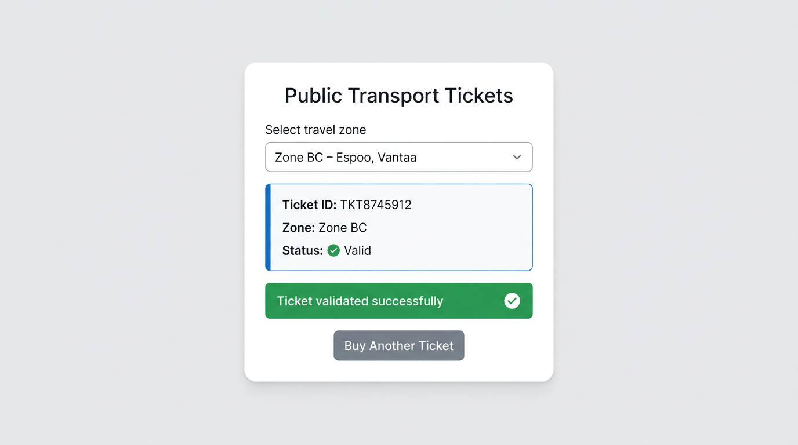
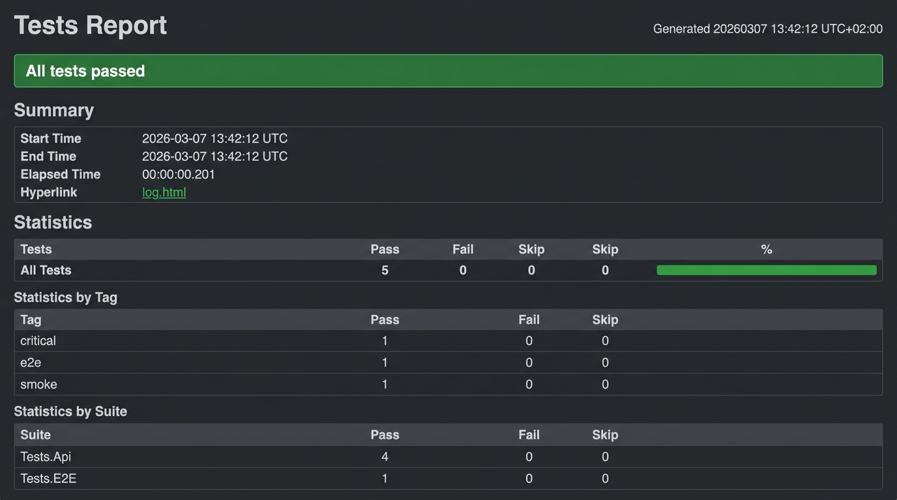
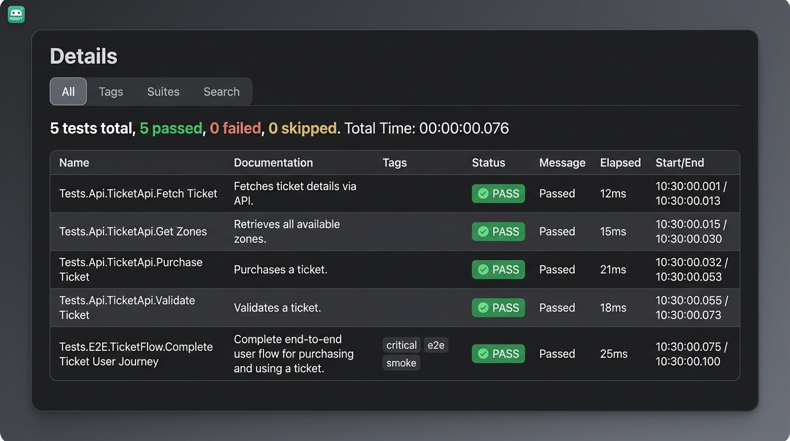

# Ticketing Test Automation Demo

Demo project simulating E2E test automation for a public transport ticketing system (HSL-style).



## Tech Stack

- **Python 3.12**
- **FastAPI** – ticketing API backend
- **React + Vite** – web UI for buying and validating tickets
- **Robot Framework** – test automation (RequestsLibrary, SeleniumLibrary)
- **Docker & Docker Compose** – containerized execution
- **GitHub Actions** – CI pipeline
- **Azure DevOps** – Terraform IaC, YAML pipeline, Test Plans–style docs

## Project Structure

```
├── api/                 # FastAPI backend
│   ├── app.py
│   ├── models.py
│   └── requirements.txt
├── frontend/            # React + Vite web UI
│   ├── src/
│   └── package.json
├── tests/
│   ├── api/             # API tests
│   │   └── ticket_api.robot
│   ├── ui/              # UI automation tests (Selenium)
│   │   └── buy_ticket.robot
│   └── e2e/             # End-to-end API tests
│       └── ticket_flow.robot
├── resources/
│   ├── keywords.robot   # API keywords
│   └── ui_keywords.robot
├── assets/              # Screenshots and report images
├── infra/
│   └── terraform/       # Azure DevOps IaC
│       ├── main.tf
│       ├── variables.tf
│       ├── outputs.tf
│       ├── providers.tf
│       ├── terraform.tfvars.example
│       └── README.md
├── docs/
│   ├── azure-devops/    # Terraform, pipeline, environments
│   └── test-management/ # Test plan, suites, traceability, defects
├── .github/
│   └── workflows/
│       ├── ci.yml      # CI workflow (push + PR)
│       └── tests.yml   # Tests workflow (push)
├── azure-pipelines.yml # Azure DevOps pipeline (API, UI, E2E)
├── docker-compose.yml
├── Dockerfile
├── LICENSE
├── requirements.txt
└── README.md
```

## API Endpoints

| Method | Endpoint | Description |
|--------|----------|-------------|
| GET | `/health` | Health check |
| GET | `/tickets` | List all tickets |
| POST | `/tickets` | Create ticket |
| GET | `/tickets/{ticket_id}` | Get ticket by ID |
| POST | `/validate` | Validate ticket |
| GET | `/zones` | List transport zones |

### Zones (HSL-style)

- AB, ABC, ABCD, BC, CD

## Quick Start

### Local (without Docker)

1. **Create a virtual environment and install dependencies:**
   ```bash
   python3 -m venv .venv
   source .venv/bin/activate   # Linux/macOS
   # or:  .venv\Scripts\activate   # Windows

   pip install -r api/requirements.txt
   pip install -r requirements.txt
   ```

2. **Start the API** (from project root):
   ```bash
   cd api && uvicorn app:app --host 0.0.0.0 --port 8000
   ```

3. **Run tests** (in another terminal, from project root with venv activated):
   ```bash
   python -m robot --exclude ui tests/
   ```

4. **Start the web UI** (optional, from project root):
   ```bash
   cd frontend && npm install && npm run dev
   ```
   Open http://localhost:5173. Run UI tests (from project root, with venv activated):
   ```bash
   python -m robot --include ui --variable APP_URL:http://localhost:5173 tests/
   ```

### Docker Compose

1. **Start API only:**
   ```bash
   docker compose up -d api
   ```

2. **Run API + frontend + tests:**
   ```bash
   docker compose up
   ```
   - API: http://localhost:8000
   - Web UI: http://localhost:3000

3. **Run API tests only** (excludes UI tests):
   ```bash
   docker compose run --rm tests
   ```

4. **Run UI tests** (API + frontend must be running):
   ```bash
   docker compose --profile ui-tests run --rm tests-ui
   ```

Test results are written to `results/` (report.html, log.html).

## CI (GitHub Actions)

Workflows run on push and pull requests to `main`:

- **ci.yml** – Push and PR; runs API + E2E tests (UI tests excluded)
- **tests.yml** – Push only; runs API + E2E tests

Steps: checkout → Python 3.12 → install deps → start API → run Robot Framework tests → upload report artifacts.

Download `report.html` and `log.html` from the Actions run page.

---

## Azure DevOps with Terraform

This project demonstrates **Azure DevOps–oriented CI/CD and test management** using Terraform, Robot Framework, Python, and automated reporting—suitable for a Senior Test Automation Engineer portfolio.

### Terraform-Based Azure DevOps Setup

Infrastructure as Code in `infra/terraform/` provisions:

- **Azure DevOps project** (Agile, all features enabled)
- **Environments** (dev, test, staging)
- **Variable groups** (API_BASE_URL, APP_URL, etc.)
- **Build pipeline** referencing `azure-pipelines.yml`

```bash
cd infra/terraform
cp terraform.tfvars.example terraform.tfvars
# Edit with org URL and PAT
terraform init && terraform apply
```

See [docs/azure-devops/terraform-setup.md](docs/azure-devops/terraform-setup.md).

### CI/CD Pipeline Structure

`azure-pipelines.yml` defines a multi-stage pipeline:

| Stage | Purpose |
|-------|---------|
| Build | Install deps, start API container |
| API Tests | Robot Framework API tests |
| UI Tests | Selenium-based UI tests |
| E2E Tests | Full user journey via API |
| Publish | Test results + artifacts (log.html, report.html, output.xml) |

Stages run in parallel where possible. Results are published to Azure DevOps Test Results and as pipeline artifacts.

See [docs/azure-devops/pipeline-architecture.md](docs/azure-devops/pipeline-architecture.md).

### Robot Framework Reporting

- **JUnit conversion**: `rebot --xunit` converts output.xml for Azure DevOps Test Results
- **Artifacts**: log.html, report.html, output.xml per test type (API, UI, E2E)
- **Variable group**: `Ticketing-Test-Config` for URLs and config



*Example report showing pass/fail status, statistics by tag (e.g. smoke, e2e, critical), and breakdown by suite (API, E2E). Results are published as pipeline artifacts and to Azure DevOps Test Results.*



*Detailed view of individual test cases: name, documentation, tags, status, and execution time. Supports traceability to test levels (API, E2E) and targeted runs (e.g. smoke, critical).*

### Test Management (Azure Test Plans Style)

Documentation in `docs/test-management/` covers:

- **Test plan**: Scope, objectives, test levels, entry/exit criteria
- **Test suites**: Smoke, API, UI, E2E, Regression
- **Test cases**: Structured cases with IDs, steps, automation status
- **Traceability matrix**: Requirements ↔ test suites ↔ test cases ↔ Robot Framework files
- **Defect management**: Lifecycle, severity, priority, triage for automated failures
- **Test data management**: Creation, isolation, repeatability

See [docs/test-management/](docs/test-management/).

## Example: Create and Validate Ticket

```bash
# Create ticket
curl -X POST http://localhost:8000/tickets \
  -H "Content-Type: application/json" \
  -d '{"zone": "AB"}'

# Validate (use ticket_id from response)
curl -X POST http://localhost:8000/validate \
  -H "Content-Type: application/json" \
  -d '{"ticket_id": "<ticket_id>"}'
```

## License

MIT License – see [LICENSE](LICENSE) for details. Copyright (c) 2026
 Karine Heinonen.
